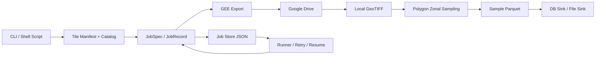
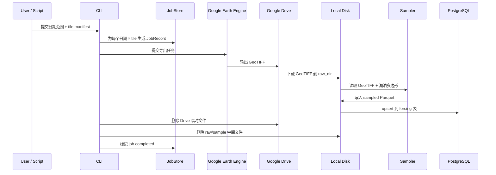

# Hydrofetch 系统文档

## 1. 系统定位

`hydrofetch` 是面向湖泊强迫数据生产的流水线系统，核心目标是把原始遥感/再分析栅格数据稳定转换为湖泊尺度的结构化 forcing 数据，并支持中断恢复、分块运行和多目标写出。

在当前实现中，`hydrofetch` 主要服务于 ERA5-Land 日尺度数据生产，完成以下闭环：

1. 从 Google Earth Engine 发起按日、按区域的栅格导出任务。
2. 通过 Google Drive 获取导出的 GeoTIFF。
3. 在本地使用湖泊多边形进行 zonal sampling。
4. 将结果写入数据库或文件。
5. 清理云端与本地中间产物，减少存储占用。

从仓库边界看，`hydrofetch` 负责“数据生产侧”；`lakeanalysis` 负责“分析消费侧”。这一边界在 `docs/architecture/package-boundaries.md` 中已有定义。

## 2. 外部可理解的一句话架构

`hydrofetch` 是一个以“日期 × 空间分块”为任务单元、以显式状态机驱动的湖泊 forcing 生产系统。

它把 GEE 导出、Drive 下载、本地采样、结果写出和故障恢复串成一条可重复执行、可恢复、可扩展的任务流水线。

## 3. 系统整体架构

从逻辑上，系统可以拆成 7 层：

1. 接口层：CLI、脚本入口、环境变量配置。
2. 任务定义层：catalog、tile manifest、日期范围、JobSpec。
3. 导出执行层：GEE export、命名规则、并发控制。
4. 中间存储层：Google Drive、本地 raw/sample/job 目录。
5. 采样计算层：GeoTIFF 读取、湖泊多边形修复、面积加权 zonal sampling。
6. 结果写出层：文件 sink、数据库 sink、组合 sink。
7. 运行治理层：状态机、持久化 job record、轮询 runner、retry 与恢复。



## 4. 模块拆解

### 4.1 CLI 与配置

- 入口：`packages/hydrofetch/src/hydrofetch/cli.py`
- 配置：`packages/hydrofetch/src/hydrofetch/config.py`

CLI 提供三个核心命令：

- `hydrofetch era5`：入队任务，并可选立即运行。
- `hydrofetch status`：查看任务状态。
- `hydrofetch retry`：重置失败任务后再次运行。

配置统一通过环境变量管理，包括：

- GEE 项目与认证文件
- Google Drive 文件夹
- 本地 `job/raw/sample` 目录
- 数据库连接
- 并发数与轮询周期

这一设计让系统既适合本地交互式运行，也适合脚本化或批处理调度。

### 4.2 Catalog

- 目录：`packages/hydrofetch/src/hydrofetch/catalog/`

Catalog 描述“导出什么数据”。它把数据集元信息从业务逻辑中解耦出来，典型内容包括：

- 数据源 asset id
- band 列表
- 空间分辨率
- CRS
- 最大像素数

这样同一套任务框架可以在不改状态机的前提下切换数据产品。

### 4.3 Export / GEE

- 导出逻辑：`packages/hydrofetch/src/hydrofetch/export/`
- GEE 客户端：`packages/hydrofetch/src/hydrofetch/gee/`

这一层负责：

- 按 `日期 × tile` 组织导出任务
- 生成稳定的导出名称和 job id
- 提交 `Export.image.toDrive`
- 轮询任务状态直到完成或失败

当前任务命名是稳定且可预测的，这使得重复入队检测、断点恢复和缓存命中都变得简单。

### 4.4 Drive

- 目录：`packages/hydrofetch/src/hydrofetch/drive/`

Drive 模块负责处理导出产物的云端落地与回收：

- 根据导出名前缀查找 `.tif`
- 下载到本地 raw 目录
- 在下游已接管后删除 Drive 临时文件

云端清理失败不会阻塞任务主链，属于非致命错误，这有利于提高整条流水线的鲁棒性。

### 4.5 Jobs

- 模型：`packages/hydrofetch/src/hydrofetch/jobs/models.py`
- 持久化：`packages/hydrofetch/src/hydrofetch/jobs/store.py`

`hydrofetch` 的核心设计之一，是把“任务定义”和“运行态”显式持久化。

其中：

- `JobSpec` 描述任务是什么
- `JobRecord` 描述任务进行到哪里
- `JobState` 定义状态顺序

每个任务对应一个 JSON 文件，落在 `job_dir` 中。这让系统天然具备以下能力：

- 进程重启后恢复
- 不依赖内存态
- 便于外部排查和审计
- 便于统计已完成、失败、活跃任务

### 4.6 Monitor / Runner

- 目录：`packages/hydrofetch/src/hydrofetch/monitor/`

Runner 负责持续轮询所有非终态任务，并把它们推进到下一状态。它同时维护并发限制，确保不会无限制提交 GEE 任务。

系统启动时会先统计已有活跃任务数量，再初始化 throttle，这意味着：

- 之前已经进入执行中的 job 会被计入并发槽位
- 重启不会打破并发约束

### 4.7 State Machine

- 目录：`packages/hydrofetch/src/hydrofetch/state_machine/`

系统主链状态如下：

```text
Hold → Export → Download → Cleanup → Sample → Write → Completed
                                         ↑
                                   Failed / Retry
```

各状态职责如下：

- `Hold`：检查是否已有最终结果，等待并发槽位，提交 GEE。
- `Export`：轮询 GEE 任务完成情况。
- `Download`：查找并下载 Drive 中的 GeoTIFF。
- `Cleanup`：删除 Drive 临时文件并释放并发槽位。
- `Sample`：执行湖泊多边形 zonal sampling。
- `Write`：写入 DB 或文件，并删除本地中间文件。

这一拆分带来的价值是：

- 每个步骤职责单一
- 故障更容易定位
- 每个步骤都能独立实现幂等
- 可在未来替换某个环节而不重写全流程

### 4.8 Sample

- 目录：`packages/hydrofetch/src/hydrofetch/sample/`
- 关键文件：`packages/hydrofetch/src/hydrofetch/sample/raster.py`

这一层负责把栅格值映射到湖泊几何。

当前系统已不再采用 point sampling，而是使用 polygon-based zonal sampling，具体是：

- 输入湖泊 Polygon / MultiPolygon
- 对多边形覆盖窗口内的每个像元计算相交面积
- 使用面积作为权重，对每个 band 计算 area-weighted mean

其技术优势是：

- 对小湖泊更稳健
- 避免 centroid 落在像元边界时的跳变
- 更符合 ERA5-Land 这种粗分辨率格网数据的空间表达

同时，该模块还负责：

- 读取 GeoJSON
- 校验 `hylak_id`
- 修复无效几何
- 处理 nodata 与空交集情况

### 4.9 Write / DB

- 写出工厂：`packages/hydrofetch/src/hydrofetch/write/factory.py`
- 数据库 schema：`packages/hydrofetch/src/hydrofetch/db/schema.py`

写出层采用 sink 组合模式，可支持：

- `file`
- `db`
- `file + db`

当前数据库写入有三个重要特征：

1. 表结构可自动创建。
2. band 列可按需自动新增。
3. 使用 `(hylak_id, date)` 作为 upsert 主键。

这意味着任务重复执行不会产生重复记录，而是按同一主键覆盖更新，天然具备幂等性。

## 5. 数据契约与输入输出

### 5.1 输入

系统运行依赖三类核心输入：

1. 时间范围
2. 空间分块定义
3. 湖泊几何

在推荐模式下，空间输入由 tile manifest 驱动。manifest 中每个 tile 至少包含：

- `tile_id`
- `geometry_path`
- `region_path`（可选）

其中：

- `geometry_path` 指向该 tile 的湖泊多边形 GeoJSON
- `region_path` 指向 GEE 导出时的区域裁剪边界

这种设计把“导出区域”和“采样对象”显式绑定在同一个 tile 上，能够避免空间逻辑错位。

### 5.2 中间产物

运行过程中会产生三类本地中间产物：

- `job_dir`：每个任务的 JSON 状态文件
- `raw_dir`：下载到本地的 GeoTIFF
- `sample_dir`：采样生成的 Parquet

在云端还会暂存：

- Google Drive 中的导出 GeoTIFF

### 5.3 输出

最终输出可以有两种：

- 文件输出：Parquet 或 CSV
- 数据库输出：PostgreSQL 表，如 `era5_forcing`

当前生产模式更适合使用 `db` sink，以减少大规模全量任务带来的文件存储压力。

## 6. 端到端数据流

下图展示一条任务从输入到落库的完整链路：



## 7. 关键设计特点

### 7.1 可恢复

由于每个任务状态都持久化到 JSON，系统可在进程退出、机器重启后继续运行，而无需重新生成全部任务。

### 7.2 幂等

系统在多个环节都实现了“重复执行安全”：

- 已完成任务不会重复入队
- 已下载文件不会重复下载
- 已存在 sample 可跳过重算
- 数据库写入为 upsert

### 7.3 分块扩展

通过 tile manifest，可以把全球任务分解成按大陆或其他区域切片的子任务。这种方式便于：

- 控制单次导出的空间范围
- 控制 GEE 并发
- 对失败 tile 定点重试
- 做逐区质量检查

### 7.4 资源清理

系统在设计上接受高 I/O 但低长期占用：

- Drive 文件下载后删除
- raw GeoTIFF 写出后删除
- 在仅用 `db` sink 时，sample Parquet 也可删除

这使其更适合长时间运行的大规模生产任务。

### 7.5 对湖泊尺度更合理的采样策略

使用面积加权 zonal sampling，而不是点抽样，是当前系统最关键的技术升级之一。它让导出后的 forcing 数据真正围绕湖泊几何聚合，而不是围绕点坐标近似。

## 8. 对外展示时建议强调的价【读博就是搞好心态】 https://www.bilibili.com/video/BV16cQdBDEBW/?share_source=copy_web&vd_source=36097fa8aeed6bbed2a07e1577b38dac值

如果该系统用于对外汇报，建议重点突出以下四点：

1. `hydrofetch` 不是单一脚本，而是具备任务治理能力的数据生产系统。
2. 它把云端导出、本地采样、数据库落库和清理流程整合成可恢复流水线。
3. 它支持按空间分块组织全球级任务，适合大规模长期运行。
4. 它采用湖泊多边形 zonal sampling，使结果更符合湖泊对象本身的空间尺度。

## 9. 当前边界与后续演进方向

当前系统仍有若干明确边界：

- 主要围绕 ERA5-Land catalog 构建
- 任务调度方式仍以 CLI + 本地目录状态为主
- 可视化监控与运行面板尚未形成独立模块
- 某些极地/岛链边缘湖仍依赖 tile 覆盖策略进一步完善

后续可演进方向包括：

- 增加更多 catalog，扩展到其他 forcing 产品
- 增加更细粒度的运行监控与统计面板
- 将 manifest 生成、质量检查、补跑策略形成更标准的配套工具链
- 提供更正式的外部 API 或服务化入口

## 10. 相关代码索引

- CLI：`packages/hydrofetch/src/hydrofetch/cli.py`
- 配置：`packages/hydrofetch/src/hydrofetch/config.py`
- catalog：`packages/hydrofetch/src/hydrofetch/catalog/`
- 导出：`packages/hydrofetch/src/hydrofetch/export/`
- GEE：`packages/hydrofetch/src/hydrofetch/gee/`
- Drive：`packages/hydrofetch/src/hydrofetch/drive/`
- Job 模型：`packages/hydrofetch/src/hydrofetch/jobs/models.py`
- Job 存储：`packages/hydrofetch/src/hydrofetch/jobs/store.py`
- Runner：`packages/hydrofetch/src/hydrofetch/monitor/runner.py`
- 状态机：`packages/hydrofetch/src/hydrofetch/state_machine/`
- 采样：`packages/hydrofetch/src/hydrofetch/sample/raster.py`
- 写出：`packages/hydrofetch/src/hydrofetch/write/`
- 数据库 schema：`packages/hydrofetch/src/hydrofetch/db/schema.py`

